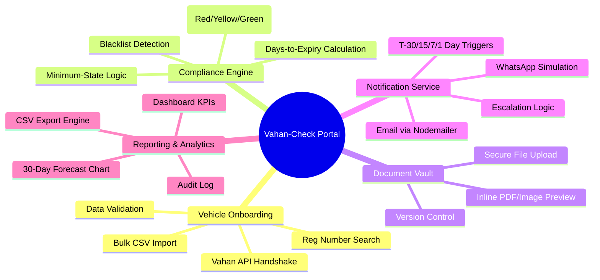
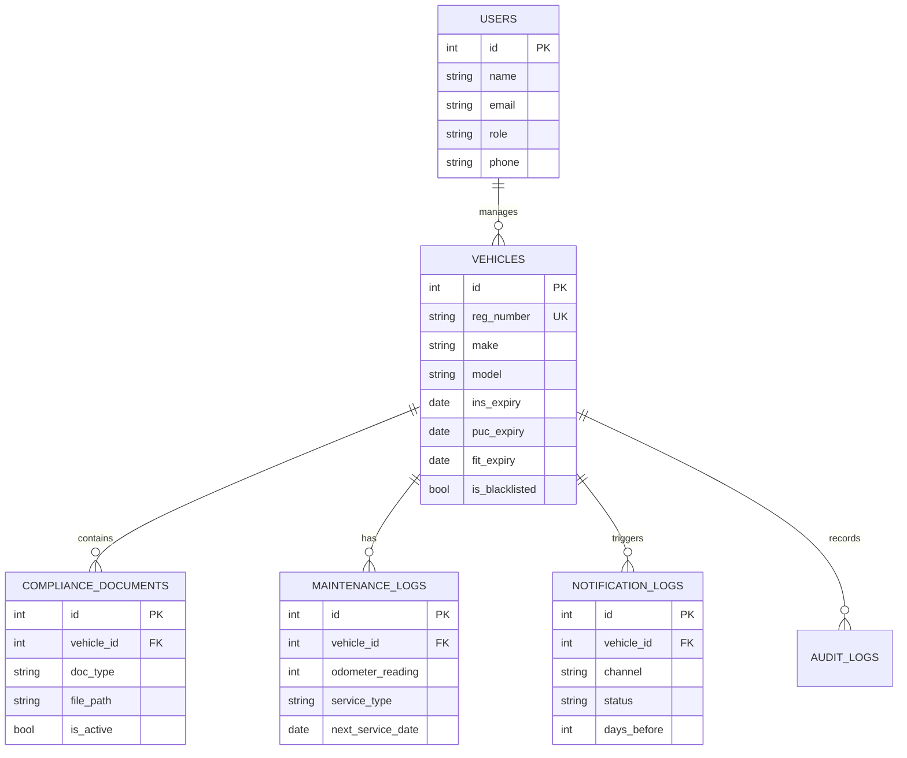
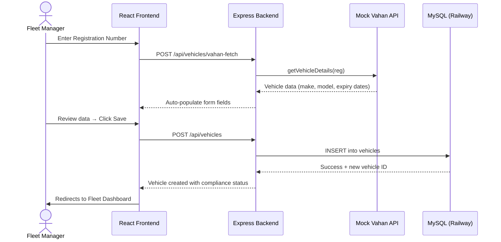

# 🚛 Vahan-Check: Fleet Compliance Portal

> **Vehicle Master** — A full-stack RTO compliance management system for the Indian logistics sector.  
> Built with React · Node.js · MySQL · Mock Vahan API

---

## Executive Summary

**Vahan-Check** is a strategic compliance management solution tailored for the Indian logistics sector. It eliminates the manual overhead of tracking vehicle legalities by synchronizing with the Vahan RTO database. Fleet managers stay ahead of document expirations — avoiding heavy penalties and operational downtime — through automated alerts, a real-time dashboard, and a secure digital document vault.

**The Problem:** Fleet managers like Rajesh struggle with manual spreadsheet tracking for hundreds of trucks. Missing an insurance or PUC renewal leads to immediate vehicle grounding and legal fines under the Motor Vehicles Act.

**The Solution:** A technical framework that provides:
- **Automated Verification** — Real-time data sync with Mock RTO records via the Vahan API
- **Proactive Risk Management** — Color-coded compliance status (Green / Yellow / Red) and automated multi-channel alerts
- **Audit-Ready Infrastructure** — A secure digital vault for all legal paperwork with version control

---

## 📂 Master Documentation Index

> [!IMPORTANT]
> For a comprehensive view of all project artifacts — including the Requirement Traceability Matrix (RTM), Data Dictionary, and Stakeholder Matrix — refer to the master sheet:
>
> 🔗 [View Master Project Documentation (Google Sheets)](https://docs.google.com/spreadsheets/d/1aunzMguja7fJIFgbvXrARp_WqN4r2-hD3bvk3_6au64/edit?gid=956115041#gid=956115041)

---

## 💻 Tech Stack

| Layer | Technology | Reason |
|---|---|---|
| **Frontend** | React 18 + Tailwind CSS | Component reusability, responsive design, fast UI |
| **Backend** | Node.js (Express) | Non-blocking I/O for concurrent API calls and cron jobs |
| **Database** | MySQL 8 (hosted on Railway) | Relational integrity for vehicles, documents, and logs |
| **Auth** | JWT + bcrypt | Stateless, role-based session management |
| **Notifications** | Nodemailer + WhatsApp sim | Email + simulated WhatsApp multi-channel alerts |
| **Scheduler** | node-cron | Daily midnight compliance refresh (IST) |
| **API Modeling** | RESTful / JSON | Standard HTTP semantics |
| **Diagramming** | Mermaid.js | Inline architectural diagrams |

---

## 🗂️ Project Structure

```
vahan-check/
├── database/
│   └── schema.sql              # All tables + seed data (5 sample vehicles)
│
├── backend/
│   ├── server.js               # Express entry point
│   ├── package.json
│   ├── .env.example            # Config template — copy to .env
│   ├── utils/
│   │   └── db.js               # MySQL connection pool
│   ├── middleware/
│   │   └── auth.js             # JWT verification + RBAC
│   ├── services/
│   │   ├── vahanApi.js         # Mock Vahan API (6 pre-loaded vehicles)
│   │   ├── complianceService.js# Green/Yellow/Red status logic
│   │   ├── notificationService.js # Email + WhatsApp dispatch
│   │   └── cronService.js      # Daily midnight cron job
│   └── routes/
│       ├── auth.js             # Login, /me, change-password
│       ├── vehicles.js         # Full CRUD + bulk import + Vahan fetch
│       ├── documents.js        # Upload, view, delete vault docs
│       ├── maintenance.js      # Odometer logs + service scheduling
│       └── reports.js          # CSV export + dashboard KPIs
│
└── frontend/
    ├── index.html
    ├── vite.config.js
    ├── tailwind.config.js
    └── src/
        ├── main.jsx
        ├── App.jsx             # Routes + protected layout
        ├── index.css           # Tailwind + global styles
        ├── context/
        │   └── AuthContext.jsx # Global auth state
        ├── services/
        │   └── api.js          # Axios instance + all API calls
        ├── utils/
        │   └── compliance.js   # Status colours, date formatting
        ├── components/
        │   ├── Sidebar.jsx     # Navigation + user info
        │   └── UI.jsx          # Modal, Badge, Toast, Field, etc.
        └── pages/
            ├── Login.jsx       # JWT login + demo account switcher
            ├── Dashboard.jsx   # KPI cards, charts, fleet overview
            ├── Vehicles.jsx    # Fleet list with search + filters
            ├── VehicleDetail.jsx # Doc vault, maintenance, expiry grid
            ├── DocumentVault.jsx # Vehicle-level document browser
            ├── Maintenance.jsx # Service-due tracker
            ├── Reports.jsx     # CSV export + notification history
            └── Alerts.jsx      # Full alert log
```

---

## 🛠️ System Architecture

### 1. Functional Decomposition



### 2. Data Architecture (ERD)



### 3. Interaction Logic (Sequence Diagram)



---

## 🚀 Quick Start

### Prerequisites

| Tool | Version | Check |
|---|---|---|
| Node.js | v18+ | `node --version` |
| npm | v9+ | `npm --version` |
| MySQL | Hosted on Railway | No local install needed |

### Step 1 — Database (Railway)

1. Go to [railway.app](https://railway.app) → New Project → Provision MySQL
2. Click the MySQL service → **Data tab** → paste contents of `database/schema.sql` → **Run Query**
3. Go to **Variables tab** → copy the 5 credentials

### Step 2 — Backend

```bash
cd vahan-check/backend
cp .env.example .env
# Open .env and fill in your Railway credentials
npm install
npm run dev
# ✅ Running on http://localhost:5000
```

### Step 3 — Frontend

```bash
# Open a second terminal
cd vahan-check/frontend
npm install
npm run dev
# ✅ Running on http://localhost:3000
```

### Step 4 — Open in browser

Navigate to **http://localhost:3000** and log in with a demo account.

---

## 🔑 Demo Accounts

| Role | Email | Password | Access |
|---|---|---|---|
| System Admin | admin@vahancheck.com | password | Full — create, edit, delete, manage users |
| Fleet Manager | manager@vahancheck.com | password | Add vehicles, upload docs, send alerts |
| Operations Staff | ops@vahancheck.com | password | View + download only |

---

## ✅ Features Implemented

| Module | Feature | BRD Ref |
|---|---|---|
| **Vehicle Onboarding** | Manual entry + Mock Vahan API auto-fill | FR-1, FR-4, FR-5 |
| **Vehicle Onboarding** | Duplicate registration detection | FR-1.5 |
| **Vehicle Onboarding** | Bulk CSV import with partial success logic | FR-1 |
| **Compliance Engine** | Green / Yellow / Red status calculation | FR-2.1, FR-2.2 |
| **Compliance Engine** | Minimum-state logic (worst doc = vehicle status) | Logic Scenario 2 |
| **Compliance Engine** | Blacklist detection (flashing red) | BR-4 |
| **Compliance Engine** | Daily midnight cron job | FR-2.3 |
| **Document Vault** | Upload PDF / PNG / JPG (max 5MB) | FR-3.1 |
| **Document Vault** | Version control (archive old, activate new) | FR-3.3 |
| **Document Vault** | Inline PDF + image viewer | FR-3.4 |
| **Notification Service** | Email alerts via Nodemailer | FR-4.2 |
| **Notification Service** | WhatsApp simulation (console + DB log) | FR-4.2 |
| **Notification Service** | T-30, T-15, T-7, T-1 day triggers | FR-8 |
| **Notification Service** | Escalation alert after 48hrs expired | FR-4.3 |
| **Notification Service** | Manual "Send Alert" button | FR-4.4 |
| **Maintenance** | Odometer logging with regression validation | FR-10 |
| **Maintenance** | Next service prediction (km + date) | FR-11 |
| **Reports** | Dashboard KPIs (compliance %, totals) | KPI-1 to KPI-4 |
| **Reports** | 30-day expiry forecast bar chart | Section 7.2 |
| **Reports** | CSV export with system footer | Section 7.4 |
| **Security** | JWT authentication + session expiry | NFR-1.2 |
| **Security** | RBAC — Admin / Fleet Manager / Operations | Section 3.2 |
| **Security** | Input sanitisation (SQL injection / XSS) | NFR-1.4 |
| **Audit** | Date override audit trail | BR-3 |

---

## 🌐 Hosting Guide (Production)

### Option A — Railway 

```bash
# Backend — deploy as a Railway service
# Connect your GitHub repo → Railway auto-detects Node.js
# Add environment variables from .env in Railway dashboard

# Frontend — build static files
cd frontend && npm run build
# Deploy dist/ to Vercel or Netlify (free)
```

---

## 📋 Portfolio Artifacts

- **BRD** — Business Requirements Document defining stakeholder needs and functional scope
- **FRD** — Functional Specification with detailed module breakdown, data dictionary, and UI specs
- **RTM** — Requirement Traceability Matrix mapping every FR to its test case
- **User Stories** — 7 Agile stories with Gherkin (Given-When-Then) acceptance criteria
- **ERD** — Normalized schema designed for high-speed lookups and relational integrity
- **Sequence Diagrams** — Interaction flows for onboarding, compliance engine, and notification dispatch

---

## 👤 Author

**Aswad Chandran A**  
Project Code: VM-2026 · Status: Draft v1.0 · Last Updated: April 2026
